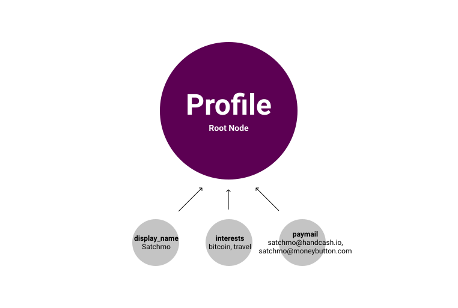

# Magic Attribute Protocol

### A Key/Value Datastore Protocol for Bitcoin

Version: 2

Prefix: *1PuQa7K62MiKCtssSLKy1kh56WWU7MtUR5*

## Intro

The design goals:

- A simple OP_RETURN protocol for associating data in a single transaction by defining key, value pairs.
- A flexible protocol suitable for many applications
- Compatible with faucets, and other situations where the input address does not represent the author's public identity
- Provide data mapping without enforcing a content, authority or identity scheme (allow other protocols to provide this).

#### Use cases
- map a comment to a url
- map an action to a txhash (like, repost, or flag a comment)
- map a photo to a geolocation
- map a 'type' to some data (this is a 'post' or a 'reply')
- map ______ to a _______
- add metadata to a metanet node
- map a metanet node to a node in another tree

## Inspiration

In Javascript, localStorage is a familliar and easy to use API. It has methods `setItem(key, value)` and `removeItem(key)`. 
Map has two commands for setting single key value pairs: `SET` and `REMOVE`.

A [Javascript  Set](https://developer.mozilla.org/en-US/docs/Web/JavaScript/Reference/Global_Objects/Set) has methods `add` and `delete`. Similarly, MAP has `ADD` and `DELETE` commands.

The context for these is set by the browser session and current http domain. We can use MAP's `SELECT` command to specify a transaction id as a context before executing one of these commands. To omit a `SELECT` is effectively using the transaction itself as the context.

In web programming, your `window` is the global context. Since Bitcoin is a giant shared context, you need to specify where you are in the graph.

| JS                                    | MAP               |
| -----------                           | -----------       |
| localStorage.setItem(key, value)      | SET key value     |
| localStorage.removeItem(key)          | REMOVE key        |
| let key = new Set(); key.add(value)   | ADD key, value    |
| key.delete(value)                     | DELETE key, value |
| localStorage.clear() / Set.clear()    | CLEAR `txid`      |

# Usage

`OP_FALSE OP_RETURN 1PuQa7K62MiKCtssSLKy1kh56WWU7MtUR5 <command> ...`

## Commands

Single Value Commands: 

[`SET`](#SET), [`SELECT`](#SELECT) + [`REMOVE`](#REMOVE)

Array / List Commands:

 [`ADD`](#ADD), [`SELECT`](#SELECT) + [`DELETE`](#DELETE)
 
 Delete:

 [`CLEAR`](#CLEAR)

Command Separator: 

[`:::`](#Command&nbsp;Separator)


___

## Single Key / Value

These commands are used on a single key/value pair.

#### SET

SET is the original and most common MAP command. It associates a key with a given value.

```markdown
SET
<key>
<value>
...
```

#### REMOVE

Used in conjunction with SELECT. REMOVE is used to remove a previously SET key or all list values at once. Not needed when using metanet protocol.

```markdown
SELECT
<txid>
REMOVE
<key> ...
```

## Array / List

These commands are used to set and remove members of a list.

#### ADD

Add one or more values to a list.

```markdown
ADD
<key>
<value> ...
```

#### DELETE

Used in conjunction with SELECT. Remove one or more values from a list. (Not needed when using metanet protocol.)

```markdown
SELECT
<txid>
DELETE
<key>
<value> ...
```

## Clear
#### CLEAR

Clear is like deleting every MAP value for a given tx, whether it is an array or a key/value pair. You can repeat txid to clear many txs at once.

```markdown
CLEAR
<txid> ...
```

## Metanet + MAP Delete / Remove

When using in conjunction with metanet protocol, it is preferred to instead write a new version of the metanet node to replace the outdataed one. This eliminates the need to use REMOVE or DELETE in many cases.

## Context

#### SELECT

Designates a context by txid. If this is a metanet node, the command applies to that node and its children.

```markdown
SELECT
<txid>
<cmd (SET | REMOVE | ADD | REMOVE)>
?...
```

Note, SELECT should be used only once per instruction set since it sets the context for the subsequent commands. 

# Command Separator

Use the command separator `:::` to declare multiple MAP commands in a single transaction. These commands are considered to be part of the same instruction set.

```markdown
MAP
SET
key
val
:::
ADD
key2
val
val
val
:::
ADD
key3
val
val
val
:::
```

This evaluates to all three commands in a single output (without repeating the protocol prefix and pipe):

`MAP SET key val`

`MAP ADD key2 val val val`

`MAP ADD key3 val val val`

#### PROTOCOL PIPELINE

MAP is designed to be chained together with other OP_RETURN protocols. The input stream flows from the left and can be piped like unix commands. For example, we can select a particular Metanet node, add content from B protocol, and associate attributes such as known gobal identifiers (txhash, url etc), and finally sign that using the Author Identity protocol:

    META | B | MAP | AIP

More about Metanet protocol:
- https://nchain.com/en/the-metanet/

More about B protocol:
- https://github.com/unwriter/B

More on protocol pipeline:
- https://github.com/unwriter/Bitcom/issues/2

More on Author Identity Protocol:
- https://github.com/BitcoinFiles/AUTHOR_IDENTITY_PROTOCOL

#### Multiple Outputs

It was not previously possible to include more than one transaction output containing `OP_RETURN`. With an update to the Bitcoin SV node software coming later this year (2019), transactions with multiple OP_RETURN outputs will be considered valid.

This allows the protocol pipelining to have a more specific meaning, and MAP instructions to be spread across multiple outputs when appropriate.

for example, we might have written a transaction that updates the values of multiple previously defined MAP instruction sets:

`MAP SELECT <tx1> DELETE key val1 val2 ::: REMOVE key4 | MAP SELECT <tx2> DELETE key val1 val2 ::: REMOVE key4`

Since the pipe is used merely as a protocol separator in this example and has no "data flow", we can instead break the instruction sets into multiple outputs:

output1: 
`MAP SELECT <tx1> DELETE key val1 val2 ::: REMOVE key4`

output2:
`MAP SELECT <tx2> DELETE key val1 val2 ::: REMOVE key4`

# Examples

## SET
In this example we will use `SET` to comment on a URL with an identity (not using the sender address as the identity's public key). Here is a simple piped OP_RETURN sequence for mapping B data to a global ID, `url` = `https://map.sv`.

```
OP_FALSE OP_RETURN B <data> <content-type> <encoding> | MAP SET 'url' 'https://twitter.com' | AUTHOR_IDENTITY_PROTOCOL <sig_type> <address> <signature>
```

A more detailed view of the same transaction. This is a comment on markdown formatted B protocol comment on the url 'https://twitter.com'. Each line here is a new pushdata:

```markdown
OP_FALSE
OP_RETURN
19HxigV4QyBv3tHpQVcUEQyq1pzZVdoAut (B)
"## Hello small world"
text/markdown
utf8
|
1PuQa7K62MiKCtssSLKy1kh56WWU7MtUR5 (MAP)
'SET'
'url'
'https://twitter.com'
|
15PciHG22SNLQJXMoSUaWVi7WSqc7hCfva (AUTHOR_IDENTITY)
'BITCOIN_ECDSA'
<address>
<signature>
 ```


Keys and values can be repeated to set multiple attributes at once:
```
MAP
SET
<key>
<val>
<key>
<val>
```
more detailed example:
```
1PuQa7K62MiKCtssSLKy1kh56WWU7MtUR5 (MAP)
'SET'
'app'
'metalens'
'type'
'comment'
'url'
'https://twitter.com'
```
Using a BMAP Planaria you can easily [query](https://b.map.sv/query/ewogICJ2IjogMywKICAicSI6IHsKICAgICJmaW5kIjogewogICAgICAiTUFQLnR5cGUiOiAiY29tbWVudCIsCiAgICAgICJNQVAudXJsIjogImh0dHBzOi8vdHdpdHRlci5jb20vIgogICAgfSwKICAgICJzb3J0IjogewogICAgICAiYmxrLmkiOiAtMQogICAgfSwKICAgICJsaW1pdCI6IDEwCiAgfQp9) for records related to this url:

```json
{
  "q": {
    "find": {
      "MAP.app": "metalens",
      "MAP.type": "comment",
      "MAP.url": "https://twitter.com/"
    }
  }
}
```

and you'll get a response like this:

```json
{
  "c": [{
    "i": 0,
    "B": {
      "content": "## Hello small world",
      "content-type": "text/markdown",
      "encoding": "utf8"
    },
    "MAP": {
      "cmd": "SET",
      "app": "metalens",
      "type": "comment",
      "url": "https://twitter.com/"
    },
    "AIP": {
      "address": "15PciHG22SNLQJXMoSUaWVi7WSqc7hCfva",
      "signature_type": "BITCOIN_ECDSA",
      "signature": <signature>
    }
  }],
  "u": []
}
```

This is an example response from a traditional Planaria such as [Genesis](https://genesis.bitdb.network/query/1FnauZ9aUH2Bex6JzdcV4eNX7oLSSEbxtN/ewogICJ2IjogMywKICAicSI6IHsKICAgICJmaW5kIjogewogICAgICAidHguaCI6ICIwMmJjOGFmNWRhN2RjMmM3NGE0NTk2YmYyNzU3MTFhNmUwZjBkMTg5MjczMGE0MTg0YmQ0NDliMTJjNWIxMGM2IgogICAgfSwKICAgICJsaW1pdCI6IDEwCiAgfQp9) for the same comment:

```json
{
  "c": [{
    "i": 0,
    "b0": { "op": 106 },
    "s1": "19HxigV4QyBv3tHpQVcUEQyq1pzZVdoAut",
    "s2": "## Hello small world",
    "s3": "text/markdown",
    "s4": "utf8",
    "s5": "|",
    "s6": "1PuQa7K62MiKCtssSLKy1kh56WWU7MtUR5",
    "s7": "SET",
    "s8": "app",
    "s9": "metalens",
    "s10": "type",
    "s11": "comment",
    "s12": "url",
    "s13": "https://twitter.com/",
    "s14": "|",
    "s15": "15PciHG22SNLQJXMoSUaWVi7WSqc7hCfva",
    "s16": "BITCOIN_ECDSA",
    "s17": "1HQ8momxTp9MYkzDLy9bFMUQgnba189qZE",
    "s18": "<signature>"
  }],
  "u": []
}
```

## REMOVE: Remove Profile Data
To remove one of the keys->value mappings from the example above.
```
1PuQa7K62MiKCtssSLKy1kh56WWU7MtUR5 (MAP)
'SELECT'
<txid>
'REMOVE'
'profile.name'
```

# Concepts
## Keys are Namespaces

Since the keyspace is shared, you can either prefix your keys with a unique identifier, or operate in the global space, sharing that dataset and inheriting the emergent schema. Sharing the global namespace can be useful when it is intended to be shared among many apps.

  Potential Namespaces for Global Identifiers

    url
    tx
    ethtx
    btctx
    topic
    upc
    infohash
    ifps
    isbn
    md5

Some global identifiers have more than one value...

  *Coordinates*

    coordinates.lat = 
    coordinates.lng =
    coordinates.alt =

  *Phone*

    phone.country_code = 1
    phone.url = 9549549544

  *Profile*

    profile.pubkey = "1HQ..."
    profile.name = "Satchmo"
    profile.text = "Hello small world!"
    profile.image = "b://98bcef1cc43ae..."
    profile.banner = "https://www..."
    

## Keys are Actions
If the above example is namespace as a noun, in this example we show a namespace can be used as a verb too. Actions usually don't need input data. Instead you act upon something that already exists. These begin new op_return chains instead of taking input from a previous protocol. This is useful if all you need is a single key to begin the chain, such as 'like'.

#### Comparison to Memo Protocol for Actions
Please note: These are not intended to limit your imagination with how to organize the keys your app uses, but to give some basic examples of how you _could_ do it. There are many viable methods for each of these cases:

Like something by txid:
```
Memo
0x6d04	txhash(32)

MAP
MAP SET 'like' 'true' tx <txhash>
```

Set your profile
```
Memo (multiple txs)
1. Set name
  0x6d01 <name>(217)

2. Set profile text
  0x6d05 <message>(217)

3. Set profile picture
  0x6d0a <url>(217)

MAP
MAP SET 'profile.name' 'Satchmo' 'profile.text' 'Some cool text' 'profile.picture' 'b://986...'
```

Follow / Unfollow users

```
Memo
Follow user:	0x6d06	address(35)		
Unfollow user:	0x6d07	address(35)		

MAP
MAP SET 'follow.user' <address>
MAP SET 'unfollow.user' <address>
```

Follow / unfollow topic
```
Memo
Topic follow:	0x6d0d	<topic_name>
Topic unfollow:	0x6d0e	<topic_name>

MAP
MAP SET 'follow.topic' <topic_name>
MAP SET 'unfollow.topic' <topic_name>

```
## Attach Content
#### Memo Commands with Content

Post
```
  Memo
  0x6d02  <message>(217)	

  MAP
  B <message> <content-type> <encoding> | MAP SET 'type' 'post'
```

Reply to Tx
```
  Memo
  0x6d03  <txhash>(32)  message(184)	

  MAP
  B <message> <content-type> <encoding> | MAP SET 'type' 'reply' 'tx' <txhash> | AUTHOR_IDENTITY
```

Repost
```
  Memo
  0x6d0b  <txhash>  <message>

  MAP
  B <message> <content-type> <encoding> | MAP SET 'type' 'repost' 'tx'  <txhash> 
```

Topic Post
```
  Memo
  0x6d0c  topic_name(variable)  message(214 - topic length)	

  MAP
  B <message> <content-type> <encoding> | MAP SET 'type' 'post' 'topic' <topic_name>
```

## MAP is Powerful - More Use Cases

Comment on a URL without identity
```
B <message> <content-type> <encoding> | MAP SET 'type' 'comment' 'url' https://google.com
```

Comment with an identity
```
B <message> <content-type> <encoding> | MAP SET 'type' 'comment' 'url' https://google.com | AUTHOR_IDENTITY
```

Attach a picture to a geolocation
```
B <image> <content-type> <encoding> | MAP SET 'coordinates.lat' <latitude> 'coordinates.lng' <latitude> 'coordinates.alt' <altitude>
```

Comment on a phone number
```
B <message> <content-type> <encoding> | MAP SET 'phone.country_code' <country_code> 'phone.number' <phone_number>
```

Comment on a UPC code
```
B <message> <content-type> <encoding> | MAP SET 'type' 'comment' 'upc' <upc_code>
```


## MAP + MetaNet with Bitcoin Schema

Lets say we want to crete the following metanet structure:




We use metanet protocol to describe the relationship between the nodes, and MAP to define metadata on each node. 

#### Bitcoin Schema
Bitcoin Schema is a declarative syntax for creating bitcoin transactions using META and MAP protocols.

Bmapjs can convert BitcoinSchema

```json
{
  "_bitcoinSchemaVersion": "0.0.1",
  "profile": {
    "name": "someone",
    "interests": ["cars","science"],
    "paymail": ["satchmo@handcash.io", "satchmo@moneybutton.com"]  
  }
}
```

The key/value pairs will be converted to MAP commands yeilding structure:

Tx 1 (Root node)
```markdown
OP_FALSE
OP_RETURN
META
null
|
MAP
SET
_nodeName
profile
```

Tx 2 (child node)
```markdown
  OP_FALSE
  OP_RETURN
  META
  <address>
  <txid of root node>
  |
  MAP
  SET
  name
  someone
  :::
  ADD
  interests
  cars
  science
```

# Example Transactions

MetaLens Comment
*`b14113a50b2d1c2a3644346662de921a60e1ed63bee9962dd4c7f7ee8a1f3ffb`*

[[BMAP]](https://b.map.sv/query/ewogICJ2IjogMywKICAicSI6IHsKICAgICJmaW5kIjogewogICAgICAidHguaCI6ICJiMTQxMTNhNTBiMmQxYzJhMzY0NDM0NjY2MmRlOTIxYTYwZTFlZDYzYmVlOTk2MmRkNGM3ZjdlZThhMWYzZmZiIgogICAgfSwKICAgICJzb3J0IjogewogICAgICAiYmxrLmkiOiAtMQogICAgfSwKICAgICJsaW1pdCI6IDEwCiAgfQp9) [[Genesis]](https://genesis.bitdb.network/query/1FnauZ9aUH2Bex6JzdcV4eNX7oLSSEbxtN/ewogICJ2IjogMywKICAicSI6IHsKICAgICJmaW5kIjogewogICAgICAidHguaCI6ICJiMTQxMTNhNTBiMmQxYzJhMzY0NDM0NjY2MmRlOTIxYTYwZTFlZDYzYmVlOTk2MmRkNGM3ZjdlZThhMWYzZmZiIgogICAgfSwKICAgICJsaW1pdCI6IDEwCiAgfQp9) [[WhatsOnChain]](https://whatsonchain.com/tx/b14113a50b2d1c2a3644346662de921a60e1ed63bee9962dd4c7f7ee8a1f3ffb)

TonicPow Campaign Request
*`219776d570037ce56d4df03ba188999f093002a023413ffdb2b5d87bb18aeea0`*

[[BMAP]](https://b.map.sv/query/ewogICJ2IjogMywKICAicSI6IHsKICAgICJmaW5kIjogewogICAgICAidHguaCI6IjIxOTc3NmQ1NzAwMzdjZTU2ZDRkZjAzYmExODg5OTlmMDkzMDAyYTAyMzQxM2ZmZGIyYjVkODdiYjE4YWVlYTAiCiAgICB9LAogICAgInNvcnQiOiB7CiAgICAgICJibGsuaSI6IC0xCiAgICB9LAogICAgImxpbWl0IjogMTAKICB9Cn0=) [[Genesis]](https://genesis.bitdb.network/query/1FnauZ9aUH2Bex6JzdcV4eNX7oLSSEbxtN/ewogICJ2IjogMywKICAicSI6IHsKICAgICJmaW5kIjogewogICAgICAidHguaCI6IjIxOTc3NmQ1NzAwMzdjZTU2ZDRkZjAzYmExODg5OTlmMDkzMDAyYTAyMzQxM2ZmZGIyYjVkODdiYjE4YWVlYTAiCiAgICB9LAogICAgImxpbWl0IjogMTAKICB9Cn0=) [[WhatsOnChain]](https://whatsonchain.com/tx/219776d570037ce56d4df03ba188999f093002a023413ffdb2b5d87bb18aeea0)

## Release Notes

#### Version 2

- Added `ADD`, `REMOVE`, `SELECT`, `CLEAR` commands. 
- Added `:::` command seperator. 
- Updated readme.

## Original Authors
Satchmo, Attila Aros

Thanks to Unwriter and for the input and support.
